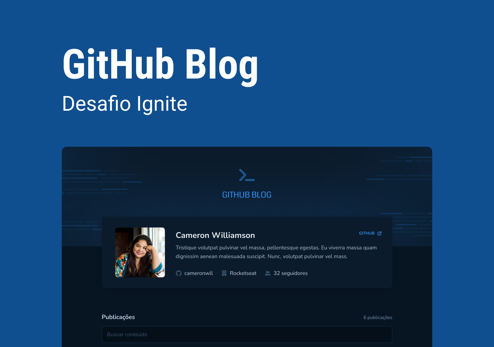

<h1 align="center">
  
</h1>

  

## 💻 Projeto

Aplicação Github Blog desenvolvida no desafio do módulo: Consumo de API e performance no ReactJS. Utilizando as `Issues` do GitHub como posts.

## ✨ Tecnologias

Esse projeto foi desenvolvido com as seguintes tecnologias:

- [Vite](https://vitejs.dev)
- [ReactJS](https://reactjs.org)
- [TypeScript](https://www.typescriptlang.org/)
- [Styled Components](https://styled-components.com)

## 🚀 Como executar

- Clone o repositório
- Rode `yarn` para baixar as dependências
- Rode o `yarn dev` para iniciar a aplicação.
